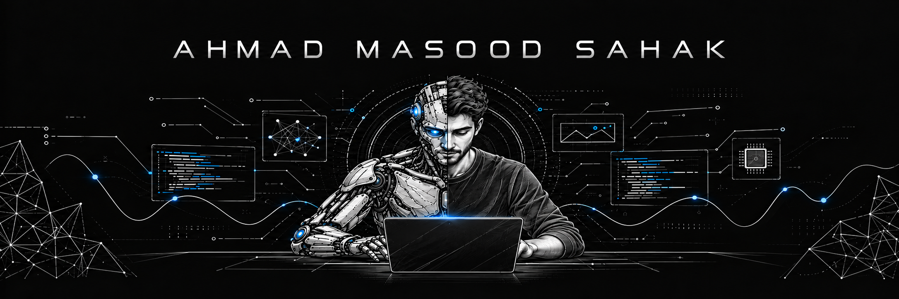

  

<h2 align="center">AI & Computer Vision Engineer</h2>

  Building production-ready vision systems for real-world environments.

  

  
  
  
  

---

## About Me

I am an **AI & Computer Vision Engineer** focused on building real-time, GPU-accelerated systems for production environments. My work connects computer vision research with industrial applications across automotive and manufacturing—from data collection and model training to multi-camera video analytics, edge deployment, and PLC-integrated inspection systems.

I develop scalable pipelines using **NVIDIA DeepStream, YOLO, DeepSORT, CUDA, TensorRT, Docker, C++, and Python**, with a strong focus on accuracy, latency, and operational reliability. After graduating at the top of my department in **Computer Technology and Information Systems**, I am currently pursuing an **M.Sc. in Computer Engineering at Sakarya University**.

---

## What I Build

- 🏭 **Industrial AI** — inspection, defect detection, tracking, measurement, and quality-control systems
- 👁️ **Computer Vision** — object detection, pose estimation, segmentation, image enhancement, and point-cloud processing
- ⚡ **Edge & GPU Inference** — NVIDIA DeepStream, CUDA, TensorRT, ONNX Runtime, and optimized video pipelines
- 🎥 **Multi-Camera Analytics** — concurrent stream processing, activity analysis, and production-line monitoring
- 🧪 **Vision MLOps** — reproducible datasets, experiment tracking, model registries, evaluation, and deployment
- 🤖 **Robotics & Integration** — ROS, Gazebo, autonomous systems, industrial cameras, PLCs, and Modbus TCP

## Current Focus

I am building maintainable vision pipelines that connect **data preparation, model training, experiment tracking, evaluation, and GPU-accelerated deployment**. I care about the complete path from a raw camera stream to a reliable production decision.

---

## Tech Stack

### 🧠 AI, Deep Learning & Computer Vision

  &nbsp;&nbsp;
  &nbsp;&nbsp;
  &nbsp;&nbsp;
  &nbsp;&nbsp;
  &nbsp;&nbsp;
  

### ⚡ GPU, Edge AI & Video Analytics

  &nbsp;&nbsp;
  &nbsp;&nbsp;
  &nbsp;&nbsp;
  

### 💻 Languages & Software Development

  &nbsp;&nbsp;
  &nbsp;&nbsp;
  &nbsp;&nbsp;
  &nbsp;&nbsp;
  &nbsp;&nbsp;
  &nbsp;&nbsp;
  

### 🧪 MLOps, Backend & Infrastructure

  &nbsp;&nbsp;
  &nbsp;&nbsp;
  &nbsp;&nbsp;
  &nbsp;&nbsp;
  &nbsp;&nbsp;
  &nbsp;&nbsp;
  &nbsp;&nbsp;
  

### 🤖 Robotics & Industrial Integration

  &nbsp;&nbsp;
  &nbsp;&nbsp;
  

---

## 📊 GitHub Stats

  
  

  
  

  

---

## Contribution Activity

  <picture>
    <source media="(prefers-color-scheme: dark)" srcset="https://raw.githubusercontent.com/ahmadmasoodsahak/ahmadmasoodsahak/output/github-contribution-grid-snake-dark.svg?v=2">
    <source media="(prefers-color-scheme: light)" srcset="https://raw.githubusercontent.com/ahmadmasoodsahak/ahmadmasoodsahak/output/github-contribution-grid-snake.svg?v=2">
    
  </picture>

---

  <em>“The best way to predict the future is to invent it.”</em> 
  <strong>— <a href="https://computerhistory.org/blog/from-alto-to-ai/">Alan Kay</a></strong>

  <a href="https://www.linkedin.com/in/masood-sahak/">LinkedIn</a>
  ·
  <a href="mailto:masood.sahak777@gmail.com">Email</a>
  ·
  <a href="https://github.com/ahmadmasoodsahak">GitHub</a>

